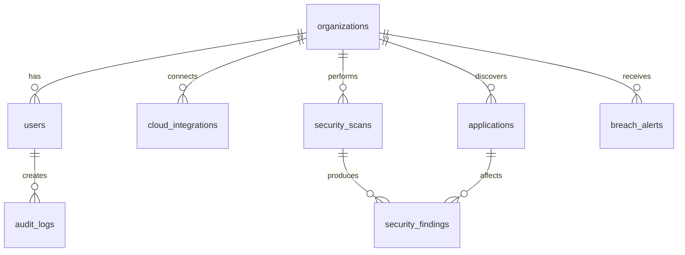

# Cloudyx Security Dashboard - Database Setup

This document explains how to set up and configure the PostgreSQL database for the Cloudyx Security Dashboard.

## Prerequisites

- PostgreSQL 14+ installed and running
- Node.js 18+ 
- npm or yarn package manager

## Quick Start

### 1. Environment Setup

Copy the environment template:
```bash
cp .env.example .env
```

Configure your database settings in `.env`:
```env
DATABASE_HOST=localhost
DATABASE_PORT=5432
DATABASE_NAME=cloudyx_security
DATABASE_USER=cloudyx
DATABASE_PASSWORD=your_secure_password_here
```

### 2. Database Creation

Create the database and user:
```sql
-- Connect to PostgreSQL as admin user
psql -U postgres

-- Create database user
CREATE USER cloudyx WITH PASSWORD 'your_secure_password_here';

-- Create database
CREATE DATABASE cloudyx_security OWNER cloudyx;

-- Grant permissions
GRANT ALL PRIVILEGES ON DATABASE cloudyx_security TO cloudyx;

-- Exit psql
\q
```

### 3. Schema Installation

Apply the database schema:
```bash
npm run db:schema
```

Or manually:
```bash
psql -U cloudyx -d cloudyx_security -f database/schema.sql
```

### 4. Seed Demo Data

Populate with demo data:
```bash
npm run db:seed
```

### 5. Test Connection

Start the development server and test the API:
```bash
npm run dev

# In another terminal, test the health endpoint:
curl http://localhost:3000/api/health

# Test demo data:
curl http://localhost:3000/api/dashboard/org_demo_startup
```

## Database Schema Overview

### Core Tables

| Table | Purpose |
|-------|---------|
| `organizations` | Company profiles and security metrics |
| `users` | User accounts and permissions |
| `cloud_integrations` | AWS/Azure/GCP connections |
| `applications` | Discovered SaaS/cloud applications |
| `security_scans` | Scan results and progress |
| `security_findings` | Individual security issues |
| `breach_alerts` | Data breach notifications |
| `compliance_frameworks` | GDPR, SOX, ISO27001, HIPAA |
| `organization_compliance` | Compliance status per org |
| `audit_logs` | Activity and security audit trail |
| `notifications` | User notifications and alerts |
| `api_keys` | API authentication tokens |

### Key Relationships



## Data Access Layer

The application uses Data Access Objects (DAOs) for database operations:

- `OrganizationDAO` - Organization management
- `UserDAO` - User management and authentication
- `ApplicationDAO` - Application discovery and risk assessment
- `SecurityScanDAO` - Security scanning operations
- `BreachAlertDAO` - Breach notification management

### Example Usage

```typescript
import { organizationDAO, userDAO } from '../lib/database';

// Create a new organization
const org = await organizationDAO.create({
  name: 'Acme Corp',
  slug: 'acme-corp',
  type: 'smb',
  employees: 50,
  industry: 'Technology'
});

// Get organization with statistics
const orgWithStats = await organizationDAO.getWithStats(org.id);

// Create admin user
const admin = await userDAO.create({
  organizationId: org.id,
  email: 'admin@acme.com',
  firstName: 'John',
  lastName: 'Doe',
  role: 'owner'
});
```

## Environment Variables

### Required

| Variable | Description | Example |
|----------|-------------|---------|
| `DATABASE_HOST` | PostgreSQL host | `localhost` |
| `DATABASE_PORT` | PostgreSQL port | `5432` |
| `DATABASE_NAME` | Database name | `cloudyx_security` |
| `DATABASE_USER` | Database user | `cloudyx` |
| `DATABASE_PASSWORD` | Database password | `secure_password` |

### Optional

| Variable | Description | Default |
|----------|-------------|---------|
| `NODE_ENV` | Environment mode | `development` |
| `DATABASE_SSL` | Enable SSL connection | `false` |
| `LOG_LEVEL` | Logging verbosity | `info` |

## Production Deployment

### Managed PostgreSQL Services

**Vercel Postgres** (Recommended for Vercel deployments):
```bash
# Install Vercel CLI
npm i -g vercel

# Create Postgres database
vercel postgres create

# Get connection string
vercel env ls
```

**AWS RDS PostgreSQL**:
```env
DATABASE_HOST=your-instance.region.rds.amazonaws.com
DATABASE_PORT=5432
DATABASE_NAME=cloudyx_security
DATABASE_USER=cloudyx
DATABASE_PASSWORD=your_secure_password
```

**Google Cloud SQL**:
```env
DATABASE_HOST=127.0.0.1  # Via cloud_sql_proxy
DATABASE_PORT=5432
DATABASE_NAME=cloudyx_security
DATABASE_USER=cloudyx
DATABASE_PASSWORD=your_secure_password
```

### Security Considerations

1. **Connection Security**:
   - Always use SSL in production (`DATABASE_SSL=true`)
   - Use connection pooling (implemented in `lib/database.ts`)
   - Set appropriate connection limits

2. **Access Control**:
   - Use dedicated database user with minimal privileges
   - Enable row-level security for multi-tenant data
   - Audit database access logs

3. **Data Protection**:
   - Encrypt sensitive fields (OAuth tokens, API keys)
   - Implement proper backup and recovery
   - Use environment variables for secrets

### Performance Optimization

1. **Indexes**: All critical queries have supporting indexes
2. **Connection Pooling**: Configured with max 20 connections
3. **Query Optimization**: Use EXPLAIN ANALYZE for slow queries
4. **Caching**: Consider Redis for frequently accessed data

## Monitoring and Maintenance

### Health Checks

The `/api/health` endpoint monitors:
- Database connectivity
- Connection pool status
- Query performance
- Memory usage

### Backup Strategy

```bash
# Daily backup
pg_dump -U cloudyx -h localhost cloudyx_security | gzip > backup_$(date +%Y%m%d).sql.gz

# Restore from backup
gunzip -c backup_20240101.sql.gz | psql -U cloudyx -d cloudyx_security
```

### Performance Monitoring

Monitor these metrics:
- Connection pool utilization
- Query execution time
- Database size growth
- Index usage statistics

## Troubleshooting

### Common Issues

**Connection refused**:
```bash
# Check if PostgreSQL is running
sudo systemctl status postgresql

# Check connection settings
psql -U cloudyx -h localhost -d cloudyx_security
```

**Permission denied**:
```sql
-- Grant missing permissions
GRANT ALL PRIVILEGES ON ALL TABLES IN SCHEMA public TO cloudyx;
GRANT ALL PRIVILEGES ON ALL SEQUENCES IN SCHEMA public TO cloudyx;
```

**Schema not found**:
```bash
# Re-apply schema
npm run db:schema

# Or manually
psql -U cloudyx -d cloudyx_security -f database/schema.sql
```

### Migration Strategy

For schema updates:
1. Create migration files in `database/migrations/`
2. Version migrations sequentially
3. Test migrations on development data
4. Apply in production during maintenance window

## Support

For database-related issues:
1. Check the health endpoint: `/api/health`
2. Review application logs
3. Verify environment variables
4. Test database connectivity manually

## Development Workflow

1. **Local Development**:
   ```bash
   # Start database
   sudo systemctl start postgresql
   
   # Apply schema changes
   npm run db:schema
   
   # Seed with fresh data
   npm run db:seed
   
   # Start development server
   npm run dev
   ```

2. **Testing API**:
   ```bash
   # Health check
   curl http://localhost:3000/api/health
   
   # Demo organizations
   curl http://localhost:3000/api/dashboard/org_demo_startup
   curl http://localhost:3000/api/dashboard/org_demo_smb
   ```

3. **Database Inspection**:
   ```bash
   # Connect to database
   psql -U cloudyx -d cloudyx_security
   
   # List tables
   \dt
   
   # Describe table structure
   \d organizations
   
   # Sample queries
   SELECT name, type, privacy_score FROM organizations;
   ```